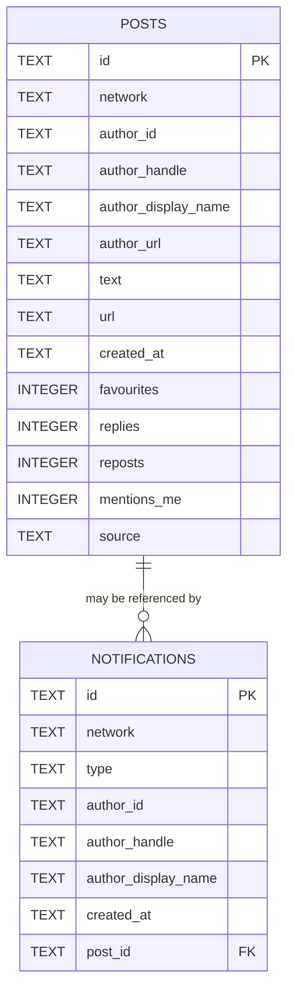

# Database schema for `social-report.sqlite`

`social-report.sqlite` stores normalised snapshots from supported social networks. It is created automatically at the configured `databasePath` when the CLI runs. The database is deliberately small: it stores posts and notifications, while scoring remains an in-memory report-generation step.

## Content types

The code uses two durable content types before writing SQLite rows.

### `SocialPost`

A `SocialPost` is one piece of network content that can be scored and rendered.

| Field | TypeScript type | SQLite column | Notes |
| --- | --- | --- | --- |
| `id` | `string` | `posts.id` after prefixing with network | Native network id is prefixed as `<network>:<id>` for storage. |
| `network` | `'mastodon' \| 'bluesky'` | `posts.network` | Network namespace. |
| `author.id` | `string` | `posts.author_id` | Native author/account id. |
| `author.handle` | `string` | `posts.author_handle` | Human handle. |
| `author.displayName` | `string` | `posts.author_display_name` | Display name with network-specific fallback. |
| `author.url` | `string \| undefined` | `posts.author_url` | Stored as `NULL` when absent. |
| `text` | `string` | `posts.text` | Plain text after network-specific normalisation. |
| `url` | `string \| undefined` | `posts.url` | Stored as `NULL` when absent. |
| `createdAt` | `string` | `posts.created_at` | Network timestamp string, usually ISO-like. |
| `favourites` | `number` | `posts.favourites` | Likes/favourites count. |
| `replies` | `number` | `posts.replies` | Reply count. |
| `reposts` | `number` | `posts.reposts` | Boost/repost count. |
| `mentionsMe` | `boolean` | `posts.mentions_me` | Stored as `1` or `0`. |
| `source` | `'timeline' \| 'notification' \| 'list'` | `posts.source` | Collector source after normalisation. |

### `SocialNotification`

A `SocialNotification` is an interaction event from a network. It may or may not point to a normalised post.

| Field | TypeScript type | SQLite column | Notes |
| --- | --- | --- | --- |
| `id` | `string` | `notifications.id` after prefixing with network | Native notification id is prefixed as `<network>:<id>` for storage. |
| `network` | `'mastodon' \| 'bluesky'` | `notifications.network` | Network namespace. |
| `type` | `string` | `notifications.type` | Network notification type/reason. |
| `author.id` | `string` | `notifications.author_id` | Actor id. |
| `author.handle` | `string` | `notifications.author_handle` | Actor handle. |
| `author.displayName` | `string` | `notifications.author_display_name` | Actor display name. |
| `post` | `SocialPost \| undefined` | `notifications.post_id` | Stored as the related prefixed post id, or `NULL`. |
| `createdAt` | `string` | `notifications.created_at` | Network timestamp string. |

## Tables

### `posts`

```sql
CREATE TABLE IF NOT EXISTS posts (
  id TEXT PRIMARY KEY,
  network TEXT NOT NULL,
  author_id TEXT NOT NULL,
  author_handle TEXT NOT NULL,
  author_display_name TEXT NOT NULL,
  author_url TEXT,
  text TEXT NOT NULL,
  url TEXT,
  created_at TEXT NOT NULL,
  favourites INTEGER NOT NULL,
  replies INTEGER NOT NULL,
  reposts INTEGER NOT NULL,
  mentions_me INTEGER NOT NULL,
  source TEXT NOT NULL
);
```

#### Column notes

| Column | SQLite type | Required | Example | Meaning |
| --- | --- | --- | --- | --- |
| `id` | `TEXT` | yes, primary key | `mastodon:110000000000000000` | Stable storage id made from network and native post id. |
| `network` | `TEXT` | yes | `mastodon` | Network name. |
| `author_id` | `TEXT` | yes | `109999999999999999` | Native account id or DID. |
| `author_handle` | `TEXT` | yes | `example@example.social` | Author handle as shown by the network. |
| `author_display_name` | `TEXT` | yes | `Example Author` | Display name used in reports. |
| `author_url` | `TEXT` | no | `https://example.social/@example` | Profile URL when known. |
| `text` | `TEXT` | yes | `A useful TypeScript note` | Normalised post text. |
| `url` | `TEXT` | no | `https://example.social/@example/110...` | Original post URL when known. |
| `created_at` | `TEXT` | yes | `2026-05-09T08:12:00.000Z` | Post creation/indexing timestamp. |
| `favourites` | `INTEGER` | yes | `4` | Favourite/like count. |
| `replies` | `INTEGER` | yes | `1` | Reply count. |
| `reposts` | `INTEGER` | yes | `2` | Reblog/repost count. |
| `mentions_me` | `INTEGER` | yes | `0` | Boolean stored as `0` or `1`. |
| `source` | `TEXT` | yes | `list` | Normalised source: `timeline`, `notification`, or `list`. |

### `notifications`

```sql
CREATE TABLE IF NOT EXISTS notifications (
  id TEXT PRIMARY KEY,
  network TEXT NOT NULL,
  type TEXT NOT NULL,
  author_id TEXT NOT NULL,
  author_handle TEXT NOT NULL,
  author_display_name TEXT NOT NULL,
  created_at TEXT NOT NULL,
  post_id TEXT
);
```

#### Column notes

| Column | SQLite type | Required | Example | Meaning |
| --- | --- | --- | --- | --- |
| `id` | `TEXT` | yes, primary key | `mastodon:12345` | Stable storage id made from network and native notification id. |
| `network` | `TEXT` | yes | `mastodon` | Network name. |
| `type` | `TEXT` | yes | `mention` | Native notification type or reason. |
| `author_id` | `TEXT` | yes | `109999999999999999` | Actor's native account id or DID. |
| `author_handle` | `TEXT` | yes | `reader@example.social` | Actor handle. |
| `author_display_name` | `TEXT` | yes | `Helpful Reader` | Actor display name. |
| `created_at` | `TEXT` | yes | `2026-05-09T08:20:00.000Z` | Notification timestamp. |
| `post_id` | `TEXT` | no | `mastodon:110000000000000000` | Related `posts.id` when the notification has a post. |

## Relationships

The schema has one logical relationship:



`notifications.post_id` is intended to reference `posts.id`, but the current migration does not declare a formal SQLite foreign key constraint. Treat it as an application-level relationship.

Practical joins:

```sql
SELECT
  notifications.created_at,
  notifications.type,
  notifications.author_handle,
  posts.url,
  posts.text
FROM notifications
LEFT JOIN posts ON posts.id = notifications.post_id
ORDER BY notifications.created_at DESC;
```

## How rows are written

Both tables use `INSERT OR REPLACE`. That means:

- a new post or notification creates a row;
- a repeated id replaces the previous row;
- the database behaves like a latest-known snapshot store for each id, not an append-only event log;
- report directories remain the best record of what a generated report looked like on a specific day.

## What is not stored

The following report-time data is not currently persisted in SQLite:

- score;
- score reasons;
- positive topic matches;
- negative topic matches;
- generated report directory;
- collection run id;
- raw network JSON;
- Mastodon list title that produced a list-sourced post.

If future analysis needs to compare scores over time, add a `runs` table and a `post_scores` table instead of overloading `posts` with mutable score columns.

## Suggested future schema if analysis grows

A future durable analytics schema could add:

```text
runs
  id
  generated_at
  since
  config_hash
  requested_networks

post_scores
  run_id -> runs.id
  post_id -> posts.id
  score
  score_reasons_json
  positive_matches_json
  negative_matches_json

post_sources
  post_id -> posts.id
  run_id -> runs.id
  source
  source_detail
```

That would preserve the current snapshot tables while making each report reproducible from database data.
